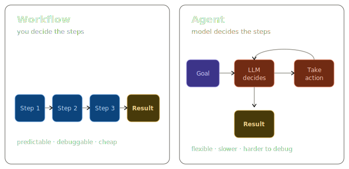

# LLM Workflow Patterns

Based on Anthropic's [Building Effective Agents](https://www.anthropic.com/engineering/building-effective-agents),
which found that the most successful LLM implementations use simple, composable patterns
rather than complex frameworks or specialized libraries.

The patterns here follow that principle: start with a single LLM call, and introduce
structure only when the task requires it.

All seven examples use the same e-commerce dataset so the structural differences between
patterns are easy to compare.

---

## What are agents?

Anthropic draws a line between two architectural categories, the distinction that matters most, before you write a line of code:

A **workflow** is a predetermined sequence of LLM calls. You wrote the steps. The model fills in the content. Predictable, debuggable, cheap.

An **agent** is a loop where the model itself decides the next step. It picks tools, retries, branches. Flexible, but slower, more expensive, and harder to debug.



Patterns 01–04 and 06 in this repo are workflows. Pattern 05 (Orchestrator-Workers) is the closest to an agent: the orchestrator decides mid-run whether to continue, pivot, or stop, rather than following a fixed plan.

## When (and when not) to use agents

Default to workflows. Reach for an agent only when the task genuinely can't be predetermined — that's a smaller slice of real problems than it feels like. A lot of "agent" projects are workflows wearing a costume, and they'd be faster, cheaper, and easier to debug rewritten as plain steps.

---

## Decision Tree



---

## Patterns

| File | Pattern | Task |
|---|---|---|
| `01_workflow_single_call.ts` | Single Call | Which product had the highest Q3 revenue, and why? |
| `02_workflow_chain.ts` | Prompt Chaining | Raw orders → daily totals → trend → executive one-liner |
| `03_workflow_route.ts` | Routing | Classify analyst query → dispatch to specialist (revenue / inventory / customer / anomaly) |
| `04_workflow_parallelization_sectioning.ts` | Parallelization — Sectioning | Analyze revenue by region, category, and segment simultaneously via `Promise.all` |
| `04_workflow_parallelization_voting.ts` | Parallelization — Voting | Three independent anomaly reviewers; surface only findings flagged by ≥2 reviewers |
| `05_workflow_orchestrator_workers.ts` | Orchestrator-Workers | Full Q3 business review — orchestrator plans subtasks, observes intermediate results, and re-plans across iterations (max 3) before synthesizing |
| `06_workflow_evaluator_optimizer.ts` | Evaluator-Optimizer | Generate a board-slide narrative, refine until it passes CFO-grade criteria (max 3 iterations) |

---

## Dataset

Hardcoded synthetic Q3 2024 snapshot.

- **8 products** across Electronics, Apparel, and Home & Kitchen
- **25 orders** with orderId, date, customerId, productId, quantity, unitPrice, region
- **4 regions**: North, South, East, West
- **10 customers** with segment: Enterprise | SMB | Consumer

---

## Quick Start

```bash
npm install

cp .env.example .env
# add your OPENAI_API_KEY

npx tsx src/01_workflow_single_call.ts
npx tsx src/02_workflow_chain.ts
npx tsx src/03_workflow_route.ts
npx tsx src/04_workflow_parallelization_sectioning.ts
npx tsx src/04_workflow_parallelization_voting.ts
npx tsx src/05_workflow_orchestrator_workers.ts
npx tsx src/06_workflow_evaluator_optimizer.ts

# or via npm scripts
npm run 01
npm run 02
npm run 03
npm run 04-sectioning
npm run 04-voting
npm run 05
npm run 06

# validate all patterns against ground truth
npm run validate
```

---

## Architecture

### `openai.ts` — Typed LLM calls

Every pattern imports `llmCall<T>`:

```typescript
llmCall<T>(prompt: string, schema: ZodType<T>, system?: string, model?: string): Promise<T>
```

The model is instructed to return valid JSON, validated against the caller's Zod schema.

### `data.ts` — Shared dataset

All seven pattern files import from the same `orders`, `products`, and `customers` arrays.

### Self-contained files

Each pattern file imports only from `openai.ts` and `data.ts`. No cross-pattern dependencies.
